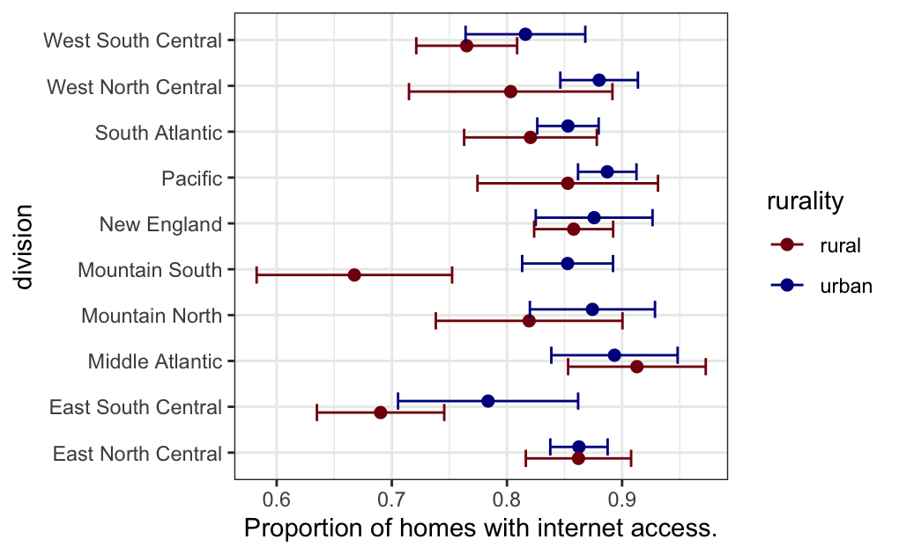
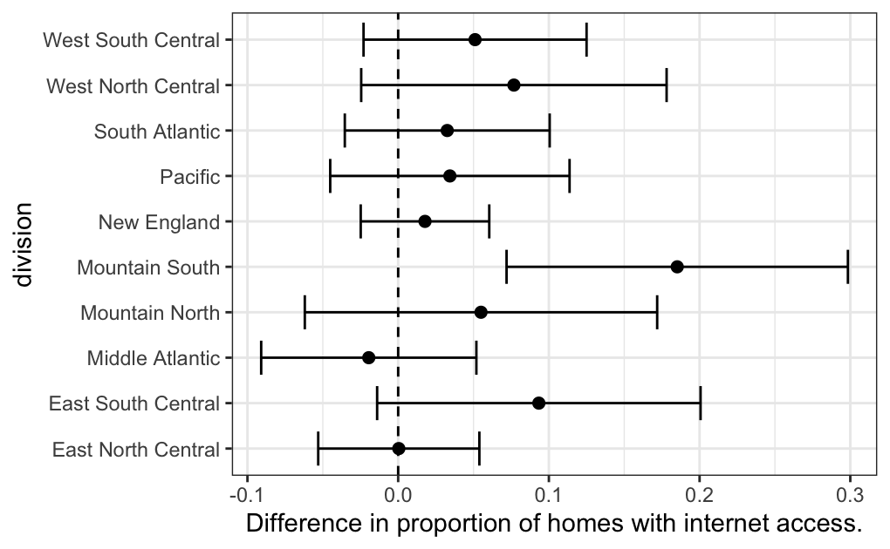

# Stats506_public

## About 

#### course homepage: http://jbhender.github.io/Stats506/F20
#### git repository: https://github.com/rurithu/Stats506_public

## Activities 
Group Members: 

**Weeks 1-3**

Tianshi Wang - https://github.com/SkyWang0919/Stats506_public

**Weeks 4-6**

Yawen Hu - https://github.com/yawenh/Stats506_public

Yanyu Long - https://github.com/longyyu/Stats506_public

Chen Shang 

#### Week 1 
* Part 1 - Prepare your workspace 
  + set up terminal to execute template 
* Part 2 - Download the data and then extract information from the columns 
  + once we extract the information, save it into a new script.
* Part 3 - Modify previous script to make it executable 
#### Week 2 
* This week we worked on simple R computing problems, including: 
  + finding values of variables, which have been assigned to different built in functions 
  + determining the attributes of a dataset 
  + working through for-loops
#### Week 3 
* Part 1 - Create new Github repo 
  + update ReadMe with weeks 1-3 activities 
* Part 2 - Learn about branches in git 
  + create a branch and then modify it with different git commands
#### Week 4 
##### Part 1
* Work with dplyr pipes 
  + write and interpret dplyr pipes to explore _Orange_ dataset 
##### Part 2
* Use ggplot2 package to visualize 2015 RECS data 
  + Dataset: w4_p2_RECS2015_internet.csv ([link](https://github.com/jbhender/Stats506_F20/blob/master/activities/week4/w4_p2_RECS2015_internet.csv)) 
  + Plot showing the proportion of homes with internet access in different division of homes 
  
  + Plot showing the difference in proportions from the previous plot 
    
  
